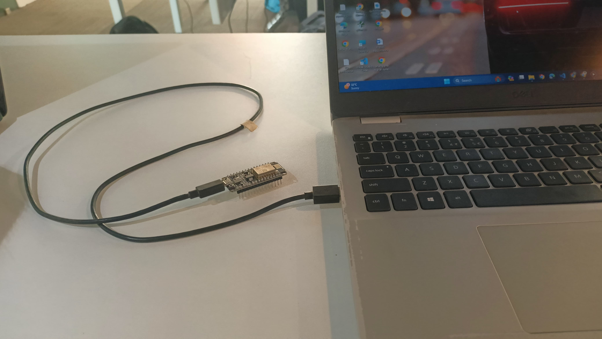

# NODEMCU 12E EEPROM Data Storage Firmware

## Overview
This firmware project demonstrates how to store data in the EEPROM of an ESP8266-12E microcontroller using NodeMCU firmware. The EEPROM on ESP8266-12E has a space of 4KB. Storing data in EEPROM is useful for saving configurations, user preferences, or any other data that needs to persist between power cycles.

## Datas
- Here i am used MCU : NODEMCU 12E 
- Protocol : UART 
- Baud Rate : 2400 
- EEPROM Memory : 4kb 

## Features
- Read and write data to EEPROM on ESP8266-12E.
- Customizable EEPROM memory addresses and data size.
- Error checking and handling for EEPROM operations.
- Serial debug output for monitoring and troubleshooting.

## Demo
[Watch the Demo Video](link-to-demo-video)

## Contact
For any inquiries or support, please contact [Your Name] at [your-email@example.com].

